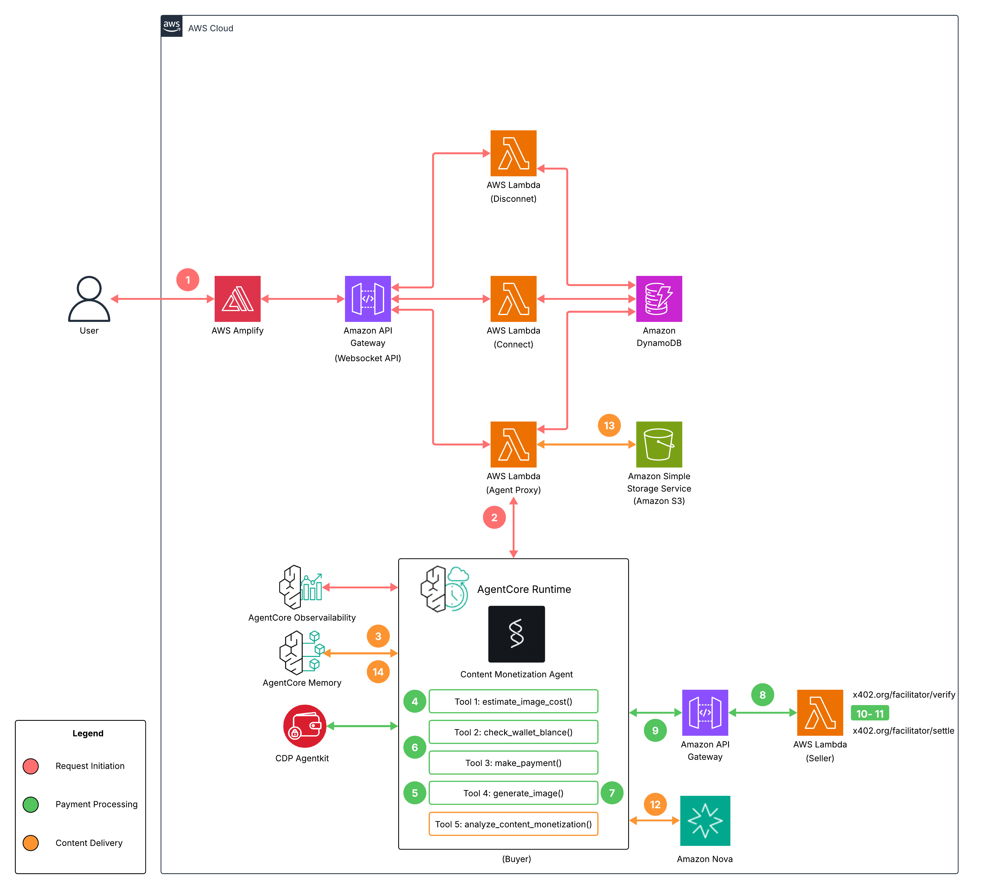

# Agentic Payments on AWS

**Authored by:** Chris Wajule and Simon Goldberg

This solution enables pay-per-use AI content generation using the x402 payment protocol. Users pay with USDC on Base Sepolia to access Amazon Nova Canvas image generation through an autonomous AI agent powered by Amazon Bedrock AgentCore. The agent handles payments automatically using CDP AgentKit, eliminating the need for manual wallet interactions.

For full platform deployment including the serverless architecture and frontend, refer to the main README in the root directory.

## Table of Contents

- [Architecture](#architecture)
- [Using the Agent](#using-the-agent)
- [API Reference](#api-reference)
- [Development and Testing](#development-and-testing)
- [Troubleshooting](#troubleshooting)

## Architecture



The solution includes three main components: Request Initiation (salmon arrows, steps 1-2), Payment Processing (green arrows, steps 4-11), and Content Delivery (orange arrows, steps 3, 12-14).

The numbers in the following flow correspond to an autonomous agent executing stablecoin payments for AI-generated content:

1. **WebSocket Connection:** The user connects to the Amazon API Gateway WebSocket endpoint. The Connect Lambda stores the connection ID in Amazon DynamoDB.

2. **User Request:** The user sends a prompt with a session ID via a WebSocket connection. The Agent Lambda forwards the request to Amazon Bedrock AgentCore Runtime `/invocations` endpoint. The request includes a session ID for isolation.

3. **Agent Initialization:** Amazon Bedrock AgentCore loads the agent configuration and initializes Amazon Bedrock AgentCore Memory for session storage. The agent using Anthropic Claude Sonnet 4.5 as the reasoning engine, receives the prompt and determines the required action.

4. **Cost Estimation:** The agent invokes the `estimate_image_cost` tool. The tool calculates the fixed cost ($0.04 USDC for `1024x1024` standard quality) and generates a unique request ID. The cost, prompt, and authorization status (`auth: false`) are stored in Amazon Bedrock AgentCore Memory.

5. **Authorization Check:** The agent calls `generate_image` tool. The tool checks the authorization status in session storage and finds `auth:false`. The tool returns `AUTHORIZE_CHECK` status directly to the agent without calling the gateway. This confirms user intent to pay and is not part of the x402 flow. The check is automatic but can be an explicit natural language confirmation corresponding to an CDP AgentKit wallet's allowance.

6. **Payment Authorization:** The agent calls `make_payment`. The tool verifies sufficient balance exists and sets `auth:true` in session storage. This marks the user's intent to proceed with payment but does not transfer funds

7. **Initial x402 Request:** The agent calls `generate_image` again. The tool finds `auth:true` and creates an x402 HTTP client using the CDP AgentKit wallet's dynamically exported private key. The client sends a POST request to Amazon API Gateway without an `PAYMENT-SIGNATURE` header.

8. **402 Payment Required:** AWS Lambda receives the request and returns `HTTP 402` with payment requirements. The response includes the USDC amount in wei, seller wallet address, USDC contract address, and `EIP-712` domain parameters (name: 'USDC', version: '2', chainId: 84532).

9. **EIP-712 Signature Generation:** The x402 client receives the 402 response and constructs `EIP-712` typed data. It signs the data using the CDP AgentKit wallet's `private key`, base64-encodes the signature payload, and retries the POST request with the signature in the `PAYMENT-SIGNATURE` header.

10. **Payment Verification:** Lambda extracts the payment payload from the `PAYMENT-SIGNATURE` header. It checks the nonce against the `processedPayments` map to prevent replay attacks. Lambda sends the signature to the x402.org facilitator's `/verify` endpoint, which validates the `EIP-712` signature against the USDC contract domain on Base Sepolia.

11. **Payment Settlement:** AWS Lambda calls the facilitator's `/settle` endpoint. The facilitator executes the USDC transfer on Base Sepolia using `EIP-3009 transferWithAuthorization` and returns the transaction hash. Lambda stores the hash in context, marks the nonce as processed, and returns `HTTP 200` with payment confirmation.

12. **Image Generation:** The tool invokes Amazon Nova Canvas model using the `invoke_model` API. Nova Canvas generates a `1024x1024` image based on the prompt.

13. **Response Delivery:** The generated image is stored in Amazon Simple Storage Service, and its unique ID is stored in session storage. The agent returns a success message to the frontend hosted on AWS Amplify which includes the base64-encoded image, transaction hash, and a BaseScan explorer link (`https://sepolia.basescan.org/tx/{hash}`) for on-chain verification.

14. **Session Cleanup:** The tool clears the current request ID from session storage. This allows new image generation requests while maintaining payment history for the session.

## Using the Agent

### Local Testing

1. **Start the server:**

```bash
bash scripts/run_local.sh
```

2. **Send a test request:**

```bash
curl -X POST http://localhost:8080/invocations \
  -H "Content-Type: application/json" \
  -d '{"input": {"prompt": "What are your main capabilities and what tasks are you designed for?"}, "session_id": "test-session"}'
```

### Via AgentCore Sandbox (Console)

1. Navigate to the AgentCore Runtime in the AWS Console
2. Select your deployed agent and open the **Sandbox** tab
3. Use the following test payload:

```json
{"input": {"prompt": "What are your main capabilities and what tasks are you designed for?"}, "session_id": "test-session"}
```

### Frontend Integration

To connect this agent to a frontend application with WebSocket support, refer to the main README in the root directory.

### Agent Tools

The agent exposes the following tools:

| Tool | Description |
|------|-------------|
| `estimate_image_cost` | Get cost estimate in USDC and request_id |
| `check_wallet_balance` | Verify CDP wallet has USDC funds |
| `make_payment` | Authorize payment (user consent gate) |
| `generate_image` | Create image with Nova Canvas (requires payment) |
| `analyze_content_monetization` | Analyze image with Claude Sonnet 4 |

### Example Conversation

```
User: What can you help me with?

Agent: I can help you with several image-related tasks:

       🎨 Image Generation
       - Create images using Amazon Nova Canvas based on your text descriptions
       - Handle the payment process automatically through x402 protocol

       💰 Wallet Management
       - Check your wallet balance (ETH and USDC)
       - Estimate costs for image generation before creating them

       🔍 Image Analysis
       - Analyze generated images for content monetization opportunities

User: What are my wallet details?

Agent: Here are your wallet details:

       Wallet Address: 0xxxx...xxxx
       Network: Base Sepolia (Chain ID: 84532)

       Current Balances:
       - ETH: 0.000000
       - USDC: 1.000000

       Great! You now have 1 USDC in your wallet, which should be sufficient 
       for generating images using Nova Canvas. You're all set to create some images!

User: Generate an image of a futuristic city at sunset

Agent: 🎉 Success! Your futuristic city at sunset image has been generated successfully!

       Image Details:
       - Image ID: xxxx-xxxx-xxxx-xxxx
       - Cost: $0.0400 USD
       - Payment verified on Base Sepolia blockchain
       - Transaction: View on BaseScan
         https://sepolia.basescan.org/tx/0xxxx...xxxx

       [Generated Image]
```

## API Reference

### Generate Image Endpoint (x402 Gateway)

**POST** `/generate_image`

**Headers:**
- `Content-Type: application/json`
- `PAYMENT-SIGNATURE`: Base64-encoded payment payload (required for paid requests)

**Request Body:**

```json
{
  "request_id": "uuid",
  "prompt": "Your image description",
  "price": "40000"
}
```

**Response (402 Payment Required):**

```json
{
  "x402Version": 1,
  "accepts": [{
    "scheme": "exact",
    "network": "base-sepolia",
    "maxAmountRequired": "40000",
    "payTo": "0x...",
    "asset": "0x036CbD53842c5426634e7929541eC2318f3dCF7e"
  }]
}
```

**Response (200 Success):**

```json
{
  "status": "payment_verified",
  "request_id": "uuid",
  "message": "Payment verified - proceed with image generation",
  "transaction_hash": "0x..."
}
```

## Development and Testing

### Local Development

```bash
# Create virtual environment
python3 -m venv venv
source venv/bin/activate

# Install dependencies
pip install -r requirements.txt

# Run locally
python agent.py
```

### CDK Development

```bash
cd cdk

# Build TypeScript
npm run build

# Deploy changes
cdk deploy

# View differences before deployment
cdk diff
```

## Troubleshooting

### Common Issues

1. **AccessDeniedException for AgentCore Memory:**
   - Add the AgentCore Memory permissions to the service role
   - Verify the MEMORY_ID is correct in your environment variables

2. **CDP Wallet Connection Fails:**
   - Verify CDP_API_KEY_ID and CDP_API_KEY_SECRET are correct
   - Check that CDP_WALLET_SECRET is properly formatted
   - Ensure you have USDC on Base Sepolia

3. **Payment Verification Fails:**
   - Confirm sufficient USDC balance on Base Sepolia
   - Verify SELLER_WALLET address is correct
   - Check Lambda CloudWatch logs for detailed errors

4. **Image Generation Fails:**
   - Verify Bedrock model access is enabled for Nova Canvas
   - Check the service role has AmazonBedrockFullAccess policy
   - Review CloudWatch logs for specific error messages

5. **Gateway Returns 402 After Payment:**
   - Check that the x402 client is using the correct network (base-sepolia)
   - Verify the USDC contract address matches
   - Ensure the payment amount matches the required amount

6. **CodeBuild Fails:**
   - Check CodeBuild logs in AWS Console for build errors
   - Verify ECR push permissions are configured

7. **WebSocket Connection Issues (Frontend Integration):**
   - Check WebSocket URL in root `.env` matches CDK output
   - Verify DynamoDB connections table exists
   - Review CloudWatch logs for Lambda errors

## Security

See [CONTRIBUTING](CONTRIBUTING.md#security-issue-notifications) for more information.

## License

This library is licensed under the MIT-0 License. See the LICENSE file.
