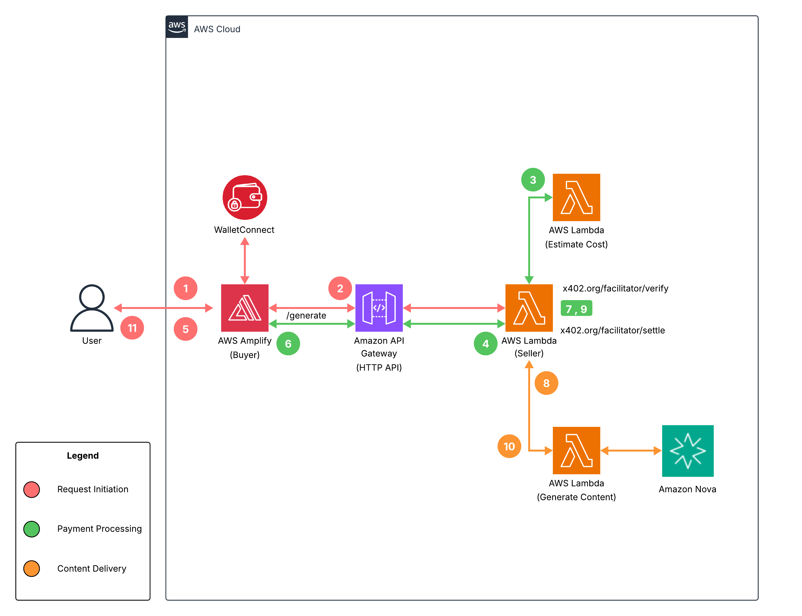

# Serverless Payments on AWS

**Authored by:** Chris Wajule and Simon Goldberg

This solution demonstrates pay-per-use AI content generation using the x402 payment protocol. Users pay with USDC on Base Sepolia to access Amazon Nova 2 Lite for text and Amazon Nova Canvas for image generation. The serverless flow allows users to sign payments via browser wallets, utilizing the x402.org facilitator to verify signatures and settle payments on-chain via EIP-3009 transferWithAuthorization.

For full platform deployment including the agentic architecture, refer to the main README in the root directory.

## Table of Contents

- [Architecture](#architecture)
- [Using the Platform](#using-the-platform)
- [API Reference](#api-reference)
- [Development and Testing](#development-and-testing)
- [Troubleshooting](#troubleshooting)

## Architecture



The solution includes three main components: Request Initiation (salmon arrows, steps 1-2, 5, 11), Payment Processing (green arrows, steps 3-4, 6-7, 9), and Content Delivery (orange arrows, steps 8, 10).

The numbers in the following flow correspond to the serverless stablecoin payment for AI-generated content:

1. **Wallet Connection:** The user clicks the wallet connect button in the React frontend. The application uses Reown AppKit to display available wallet options. The user selects their wallet and approves the connection request.

2. **Initial Request:** The user submits a prompt through the chat interface. The application sends a POST request to the `/generate` endpoint on Amazon API Gateway without payment credentials.

3. **Cost Estimation:** The Estimator Lambda function uses Amazon Bedrock `CountTokens` API to calculate input tokens. It estimates output tokens using a conservative formula (minimum 800 tokens with 20% safety margin) and estimates pricing based on the selected model.

4. **Payment Requirements:** The Seller Lambda function detects the missing `PAYMENT-SIGNATURE` header and returns `HTTP 402`. The response includes the USDC amount in wei, the seller wallet address, the USDC contract address on Base Sepolia, and `EIP-712` domain parameters.

5. **Payment Authorization:** The frontend is hosted on AWS Amplify and displays a payment modal with the cost preview. The user confirms and the application generates an `EIP-712` typed data signature using the connected wallet. The wallet prompts the user to sign the message. The signature authorizes the USDC transfer with validity timestamps and a unique nonce.

6. **Payment Submission:** The frontend retries the `/generate` request with the `EIP-712` signature in the `PAYMENT-SIGNATURE` header. The request includes the authorization object (from, to, value, validAfter, validBefore, nonce) and signature.

7. **Payment Verification:** The AWS Lambda function sends the payment payload to the x402.org facilitator's `/verify` endpoint. The facilitator validates the `EIP-712` signature against the USDC contract domain on Base Sepolia.

8. **Content Generation:** The AWS Lambda function invokes the Bedrock Lambda function. For text, it calls Amazon Nova 2 Lite using the `invoke_model` API. For images, it invokes Amazon Nova Canvas.

9. **Payment Settlement:** After successful content generation, the Lambda calls the facilitator's `/settle` endpoint. The facilitator executes the USDC transfer on-chain using `EIP-3009 transferWithAuthorization` and returns the transaction hash. The Lambda includes the settlement details in the `PAYMENT-RESPONSE` header.

10. **Response Delivery:** The Bedrock Lambda returns the generated content. The Seller Lambda constructs a response with the success message, transaction url (`https://sepolia.basescan.org/tx/{hash}`), and generated content.

11. **Frontend Display:** The application displays the payment confirmation, transaction hash, and AI-generated content in the chat interface.

## Using the Platform

### Serverless Architecture (Browser Wallet)

1. **Open the application** in your browser at the deployed Amplify URL or the local development URL.

2. **Select architecture:** Click "Serverless" in the top navigation.

3. **Select model:** Choose "Nova LLM" for text generation or "Nova Canvas" for image generation.

4. **Connect wallet:** Click the wallet button (👛) to open the WalletConnect modal. Select your wallet and approve the connection. Ensure you are on Base Sepolia network.

5. **Submit a prompt:** Type your request in the chat input and press Enter or click the send button.

6. **Review payment:** A modal displays the estimated cost in USDC. Click "Confirm" to proceed.

7. **Sign transaction:** Your wallet prompts you to sign the EIP-712 message. This authorizes the USDC transfer but does not execute it yet.

8. **Receive content:** After payment verification and settlement, the AI-generated content appears in the chat along with the transaction URL.

## API Reference

### Generate Content Endpoint

**POST** `/generate`

**Headers:**
- `Content-Type: application/json`
- `PAYMENT-SIGNATURE`: Base64-encoded payment payload (required for paid requests)

**Request Body:**

```json
{
  "content": "Your prompt text",
  "model": "nova-llm" | "nova-canvas",
  "architecture": "serverless"
}
```

**Response (402 Payment Required):**

```json
{
  "scheme": "exact",
  "network": "base-sepolia",
  "maxAmountRequired": "192",
  "payTo": "0x...",
  "asset": "0x036CbD53842c5426634e7929541eC2318f3dCF7e",
  "description": "AI content generation with nova-llm"
}
```

**Response (200 Success):**

```json
{
  "message": "Payment verified - content generated successfully",
  "status": "success",
  "content": "Generated text or base64 image data",
  "model": "nova-llm",
  "transactionUrl": "https://sepolia.basescan.org/tx/0x..."
}
```

### WebSocket Endpoint

**Connect:** `wss://{api-id}.execute-api.{region}.amazonaws.com/prod`

**Message Format:**

```json
{
  "input": { "prompt": "Your prompt text" },
  "session_id": "unique-session-id"
}
```

**Response Types:**
- `type: "complete"` - Contains generated content and images
- `type: "error"` - Contains error message

## Development and Testing

### Local Development

```bash
# Start frontend development server
npm run dev

# Build for production
npm run build

# Preview production build
npm run preview
```

### CDK Development

```bash
cd cdk

# Build TypeScript
npm run build

# Deploy changes
cdk deploy

# View differences before deployment
cdk diff
```

## Troubleshooting

### Common Issues

1. **Wallet Connection Fails:**
   - Verify WalletConnect Project ID is configured in `.env`
   - Ensure browser wallet extension is installed
   - Check that Base Sepolia network is available in your wallet

2. **Payment Verification Fails:**
   - Confirm sufficient USDC balance on Base Sepolia
   - Verify wallet is connected to Base Sepolia network
   - Check browser console for detailed error messages

3. **CORS Errors:**
   - Redeploy CDK stack: `cdk deploy`
   - Verify API Gateway URL matches `.env` configuration

4. **WebSocket Connection Issues:**
   - Check WebSocket URL in `.env` matches CDK output
   - Verify DynamoDB connections table exists
   - Review CloudWatch logs for Lambda errors

5. **Content Generation Fails:**
   - Verify Bedrock model access is enabled in your AWS account
   - Check Lambda execution role has Bedrock permissions
   - Review CloudWatch logs for specific error messages

6. **Transaction Not Found:**
   - Wait 10-30 seconds for Base Sepolia confirmation
   - Verify transaction hash on [BaseScan Sepolia](https://sepolia.basescan.org)

## Security

See [CONTRIBUTING](CONTRIBUTING.md#security-issue-notifications) for more information.

## License

This library is licensed under the MIT-0 License. See the LICENSE file.
